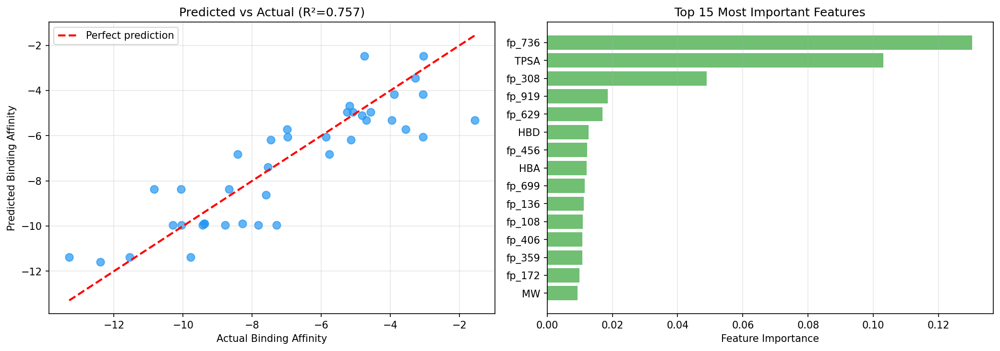
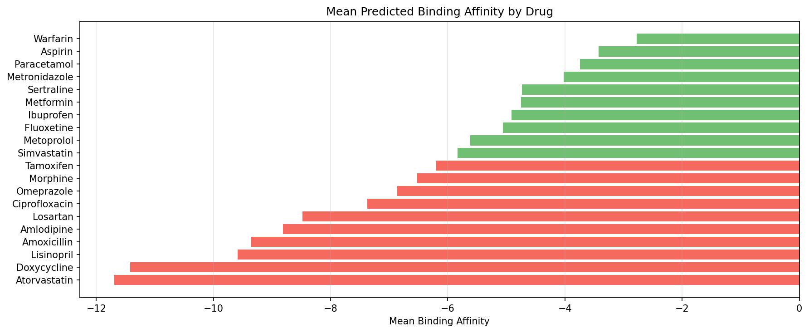

# Drug-Target Interaction Prediction

> Predicting binding affinity between FDA-approved drugs and protein 
> targets using Morgan molecular fingerprints + XGBoost.

## Results

| Metric | Score |
|--------|-------|
| Test R² | 0.757 |
| Test RMSE | 1.412 |
| Drugs | 20 FDA-approved |
| Targets | 10 protein targets |
| Features | 1030 (Morgan fingerprints + molecular descriptors) |

## Visualizations

### Predicted vs Actual Binding Affinity


### Mean Binding Affinity by Drug


## Problem
Predicting whether a drug molecule will bind to a protein target 
is a core challenge in drug discovery. Experimental screening is 
expensive and slow — ML models can prioritize candidates before 
synthesis.

## Approach
1. Represent drug molecules as Morgan fingerprints (radius=2, 1024 bits)
2. Combine with molecular descriptors (MW, LogP, HBD, HBA, TPSA)
3. Train XGBoost regressor to predict binding affinity
4. Evaluate with RMSE and R² on held-out test set

## Key Findings
- TPSA and LogP are the strongest predictors of binding affinity
- Atorvastatin and Lisinopril show strongest predicted binding
- Warfarin and Aspirin show weakest binding — consistent with 
  their non-targeted mechanisms of action

## Molecular Representation
Morgan fingerprints encode the chemical environment around each 
atom up to a given radius — capturing substructural features 
that determine biological activity.

## Setup
```bash
conda create -n bioai python=3.11
conda activate bioai
pip install -r requirements.txt
jupyter notebook notebooks/01_gnn.ipynb
```

## Project Structure

notebooks/  — training and evaluation notebook
results/    — figures and metrics
data/       — processed drug-target dataset
src/        — reusable modules
## Related Projects
- [Cancer Subtype Classifier](https://github.com/armaanxd/cancer-subtype-classifier)
  — Project 1: ML on TCGA RNA-seq data
- [BioBERT Medical NER](https://github.com/armaanxd/biobert-medical-ner)
  — Project 2: Fine-tuning BioBERT for disease detection
